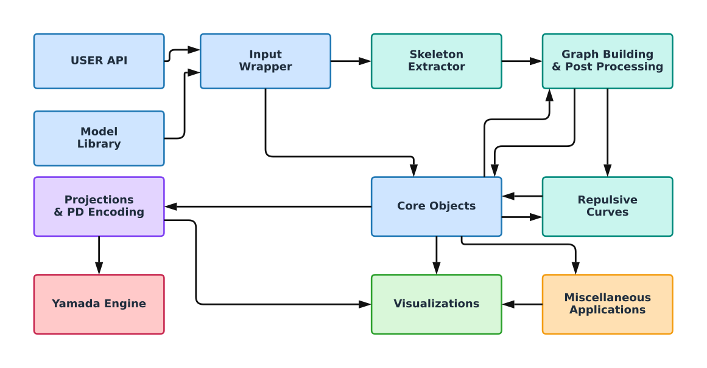

# `knotted_graph`


[](https://pypi.org/project/knotted_graph/)
[](https://sarinstein-yan.github.io/KnottedGraph/)

`knotted_graph` is a computational package for embedded spatial graphs,
planar-diagram construction, and graph polynomial invariants. It provides a
generic core for pure mathematical and computational workflows, with optional
application packages built on top.

<p align="center">
  
</p>

## Install

```bash
pip install knotted_graph
```

For local development:

```bash
git clone https://github.com/sarinstein-yan/KnottedGraph.git
cd KnottedGraph
uv sync --all-groups
```

Optional Python extras are split by workflow:

```bash
pip install "knotted_graph[nodal]"
pip install "knotted_graph[repulsion]"
pip install "knotted_graph[all]"
```

### Repulsive-layout native dependency

The `repulsion` extra installs the **Python-side dependencies**. The optional
Repulsor solver is a separate C++ dependency and is intentionally not vendored
inside `knotted_graph`.

For a reproducible source checkout, use the repository bootstrap:

```bash
python scripts/bootstrap_repulsion.py
export REPULSOR_ROOT="$PWD/external/Repulsor"
```

The bootstrap checks out the exact Repulsor revision pinned for this
KnottedGraph release and initializes its submodules. The C++ driver is compiled
lazily on first use.

The reference Linux/WSL build requires a C++20 compiler and the native libraries
linked by the driver: OpenBLAS, LAPACK/LAPACKE, `fmt`, and AMD/SuiteSparse.
On Debian/Ubuntu systems these can be installed with packages such as:

```bash
sudo apt-get update
sudo apt-get install -y \
  g++ \
  libopenblas-dev \
  liblapack-dev \
  liblapacke-dev \
  libfmt-dev \
  libsuitesparse-dev
```

See `doc/user_guide/repulsive_layout.md` and `THIRD_PARTY_NOTICES.md` for the
full setup and the pinned upstream revision.

## Quick Start

Compute a Yamada polynomial directly from a crossing-free graph:

```python
import sympy as sp

from knotted_graph.core import ThetaGraph
from knotted_graph.invariants.yamada import compute_yamada_polynomial_recursive

A = sp.Symbol("A")
theta = ThetaGraph(3)
compute_yamada_polynomial_recursive(theta, A)
```

For embedded spatial graphs, project the graph to a planar diagram and compute
from the projection with the fewest crossings:

```python
import networkx as nx
import numpy as np
import sympy as sp

from knotted_graph.projection import compute_yamada_polynomial

graph = nx.MultiGraph()
graph.add_node("u", pos=np.array([0.0, 0.0, 0.0]))
graph.add_node("v", pos=np.array([1.0, 0.0, 0.0]))
graph.add_edge(
    "u",
    "v",
    pts=np.array(
        [
            [0.0, 0.0, 0.0],
            [0.5, 0.25, 0.0],
            [1.0, 0.0, 0.0],
        ]
    ),
)

A = sp.Symbol("A")
result = compute_yamada_polynomial(
    graph,
    A,
    return_result=True,
)
print(result.polynomial)
print(result.projection.num_crossings)
```

The non-Hermitian nodal-skeleton workflow is an application package:

```python
from knotted_graph.applications.nodal import NodalSkeleton
from knotted_graph.applications.nodal.models import hopf_link_bloch_vector
```

## Documentation

The public documentation is available at
<https://sarinstein-yan.github.io/KnottedGraph/>. It contains installation
notes, generic quick starts, application tutorials, API references, and
developer architecture notes.

Build it locally with:

```bash
uv run --group docs python -m sphinx -b html -W --keep-going doc doc/_build/html
```

The root README intentionally stays generic. Physics-specific figures and the
legacy nodal-skeleton walkthrough live under `doc/applications/` and
`doc/assets/nodal/`.
