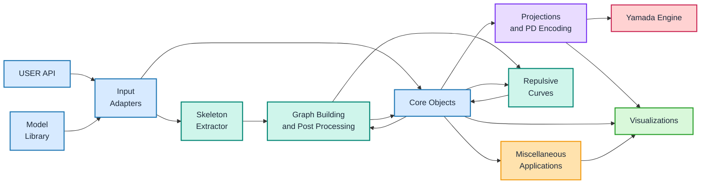

# KnottedGraph Architecture

The tracked visual counterpart of this architecture is `assets/paper/architecture.svg`.
This Markdown version is the code-navigation reference: the Mermaid flowchart and
tables below map the conceptual blocks to the current package layout and contracts.

## Mermaid Flowchart

## Edge List

| From | To | Meaning for agents |
|---|---|---|
| USER API | Input Adapters | Public package imports and user calls normalize external data. |
| Model Library | Input Adapters | Example generators and fixtures can be converted into core graph objects. |
| Input Adapters | Skeleton Extractor | Surface, volume, and application workflows that need skeletonization enter the extraction route. |
| Skeleton Extractor | Graph Building & Post Processing | The skeleton image is converted into a spatial graph. |
| Input Adapters | Core Objects | Graph, curve, biomolecular, polymer, and mesh inputs are normalized into shared core objects. |
| Graph Building & Post Processing | Core Objects | Processed graph state is cached back into core objects. |
| Core Objects | Graph Building & Post Processing | Core objects provide masks, skeletons, and graph inputs for processing. |
| Graph Building & Post Processing | Repulsive Curves | Processed graphs can be refined or relaxed for cleaner geometry. |
| Core Objects | Repulsive Curves | Core graph/diagram objects are inputs to repulsive curve routines. |
| Repulsive Curves | Core Objects | Refined layout or curve data flows back to plotting/diagram objects. |
| Core Objects | Projections & PD Encoding | Spatial graphs are projected and encoded as planar diagrams. |
| Projections & PD Encoding | Yamada Engine | PD-code vertices, crossings, and arcs feed polynomial computation. |
| Projections & PD Encoding | Visualizations | Projected diagrams can be plotted directly. |
| Core Objects | Visualizations | Surfaces, skeleton graphs, fields, and summaries are rendered. |
| Core Objects | Miscellaneous Applications | Reusable graph and field data support auxiliary analyses. |
| Miscellaneous Applications | Visualizations | Auxiliary analyses produce plotted outputs. |

## Code Anchors

| Architecture block | Primary code anchors | Notes |
|---|---|---|
| USER API | `src/knotted_graph/__init__.py`, `README.md`, `doc/index.md`, `doc/quickstart.md` | Root imports expose generic graph, projection, and invariant helpers only. Application workflows are imported from application namespaces. |
| Model Library | `src/knotted_graph/applications/nodal/models.py` | Provides predefined Bloch-vector generators used by the `NodalSkeleton` application workflow and tutorials. |
| Input Adapters | `src/knotted_graph/inputs/` | Converts coordinate chains, PDB/mmCIF backbones, polymers, spatial-graph CSV files, and surface meshes into core graph or mesh objects. |
| NodalSkeleton Application | `src/knotted_graph/applications/nodal/skeleton.py::NodalSkeleton.__init__` | Domain-specific non-Hermitian physics workflow; accepts Hamiltonian/Bloch-vector data and produces sampled fields plus a core skeleton graph. Memory-efficient lazy-grid and streamed-spectrum behavior is implemented directly in `src/knotted_graph/applications/nodal/skeleton.py`. |
| Skeleton Extractor | `NodalSkeleton.spectrum`, `NodalSkeleton._interior_mask`, `NodalSkeleton._skeleton_image`, `NodalSkeleton.skeleton_coords` | Application-specific route that builds an exceptional-surface interior mask and extracts the medial-axis skeleton with `skimage.morphology.skeletonize`. |
| Graph Building & Post Processing | `NodalSkeleton.skeleton_graph`, `src/knotted_graph/extraction/`, `src/knotted_graph/core/embedding.py` | Uses `poly2graph.skeleton2graph`, then optional leaf removal, edge simplification, RDP smoothing, and trivalence tagging. |
| Core Objects | `networkx.MultiGraph`, `src/knotted_graph/core/`, `src/knotted_graph/projection/geom.py` | Main generic objects include embedded spatial multigraphs with node `pos` and edge `pts`, abstract multigraph helpers, `PDCode`, `Vertex`, `Crossing`, and `Arc`. |
| Repulsive Curves | `src/knotted_graph/layout/repulsive/` | Optional 3D curve-network relaxation that accepts and returns the core `networkx.MultiGraph(pos/pts)` contract before projection. |
| Projections & PD Encoding | `src/knotted_graph/projection/pd_code.py::PDCode`, `src/knotted_graph/projection/rotations.py`, `src/knotted_graph/projection/pd_code.py::select_projection` | Rotates spatial graphs, projects them, detects crossings, creates arcs, and emits PD-code strings and structured objects. |
| Yamada Engine | `src/knotted_graph/invariants/yamada/polynomial.py`, `src/knotted_graph/invariants/yamada/recursive.py`, `src/knotted_graph/invariants/yamada/compact.py`, `src/knotted_graph/invariants/yamada/native.py`, `src/knotted_graph/projection/pd_code.py::compute_yamada_polynomial` | Computes exact Yamada polynomials from selected `PDCode` data. Production compact evaluators use the compiled backend when available and retain the exact Python evaluator as fallback. |
| Visualizations | `src/knotted_graph/visualization/`, `NodalSkeleton.plot_exceptional_surface`, `NodalSkeleton.plot_skeleton_graph`, `NodalSkeleton.plot_planar_diagram` | Generic graph helpers live under `visualization`; application-specific PyVista plots live under `applications.nodal`. |
| Miscellaneous Applications | `src/knotted_graph/applications/nodal/surface_modes.py`, `NodalSkeleton.graph_summary`, Petersen helpers in `src/knotted_graph/visualization/graph.py` | Includes surface-mode calculations, graph summaries, graph-minor searches, and special-purpose graph visualizations. |

## Core Data Contracts

| Data object | Producer | Consumers | Shape / contract |
|---|---|---|---|
| Core spatial graph | Input adapters, `NodalSkeleton.skeleton_graph`, user-created graphs | PD encoding, Yamada engine, repulsive layout, graph plots | `networkx.MultiGraph`; every node has finite 3D `pos`; every geometric edge may carry an `(n, 3)` `pts` polyline; parallel edge keys are preserved. |
| Input adapter result | `src/knotted_graph/inputs/` | User API, core graph consumers | Dataclass result containing normalized data, metadata, issues, and a core graph or mesh object. |
| Hamiltonian `h_k` | `NodalSkeleton.__init__` | Hermiticity/PT checks, Bloch-vector extraction | Application-specific SymPy `2x2` matrix. |
| Bloch vector `bloch_vec` | `NodalSkeleton.__init__`, model-library helpers | Grid sampling, spectrum, Berry curvature | Application-specific tuple of 3 SymPy expressions. |
| k-space axes/grids | `NodalSkeleton.__init__`, lazy grid descriptors | Bloch-vector evaluation, fields, visualization | `kx_vals`, `ky_vals`, `kz_vals` are eager 1-D axes. Public `kx_grid`, `ky_grid`, `kz_grid` remain writable `indexing="ij"` NumPy arrays but are materialized only on first explicit access. Ordinary spectrum/skeleton workflows operate from the 1-D axes without forcing the three dense coordinate grids. |
| Spectrum and band gap | `NodalSkeleton.spectrum`, `NodalSkeleton.band_gap` | Masks, fields, exceptional surface, plots | Application-specific complex/float arrays over k-space. `spectrum` accumulates Bloch-vector component squares without requiring the full three-component `_bloch_vec_grid`; `_bloch_vec_grid` remains available for callers that explicitly request it. |
| Interior mask | `NodalSkeleton._interior_mask` | Skeleton extraction, field plotting | Boolean grid where spectrum real part is zero. |
| Skeleton image | `NodalSkeleton._skeleton_image` | `skeleton_coords`, `skeleton_graph` | Boolean medial-axis image from the interior mask. |
| PyVista field volume | `NodalSkeleton.fields_pv` | Surface/vector/scalar visualizations | Optional application visualization data, `pv.ImageData` with scalar/vector point arrays. |
| Exceptional surface mesh | `NodalSkeleton.exceptional_surface_pv`, surface mesh adapter | Surface visualizations, skeletonization workflows | `pv.PolyData` contour or imported mesh object. |
| PD-code objects | `PDCode.compute` | Yamada engine, PD-code plotting | `vertices`, `crossings`, `arcs`, plus a PD-code string. |
| Yamada polynomial | `Yamada.compute`, `compute_yamada_from_states`, `PDCode.compute_yamada`, `compute_yamada_polynomial`, `NodalSkeleton.yamada_polynomial` | User API, reports, downstream math | SymPy expression in the requested variable. Embedded graph entry points use an explicit rotation when supplied; otherwise they sample rotations and choose the valid projection with the fewest crossings. |

## Maintenance Note

This file is a source-level architecture map, not a historical reconstruction artifact. When module locations, public contracts, or optimized execution paths change, update the corresponding code anchors and data-contract rows here. The tracked visual overview is `assets/paper/architecture.svg`.
